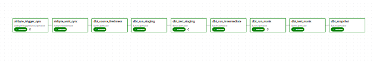
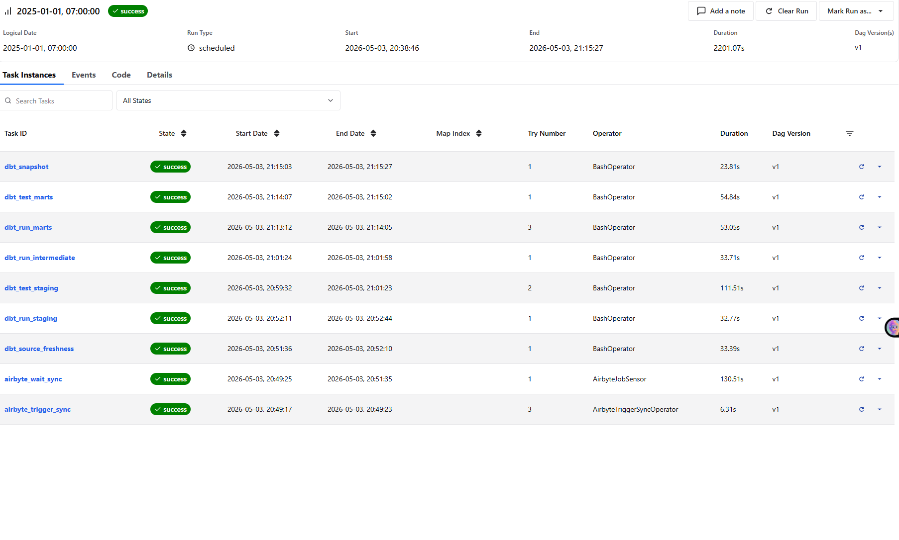
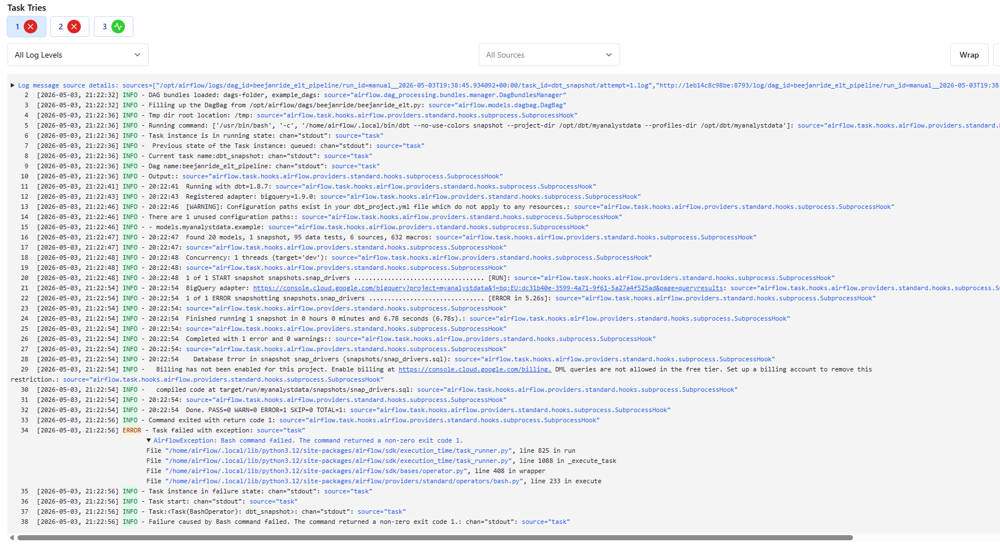

screenshots:

- dag_graph.png         DAG task graph in Airflow UI

- successful_run.png    Example of a successful DAG run (all tasks green)

- failed_run.png        Example of a failed task (red task + error log)

- failure_email.png     Gmail notification received on task failure

- backfill.png          
- architecture.png      Full architecture diagram (Postgres → Airbyte → BigQuery → dbt)
  

